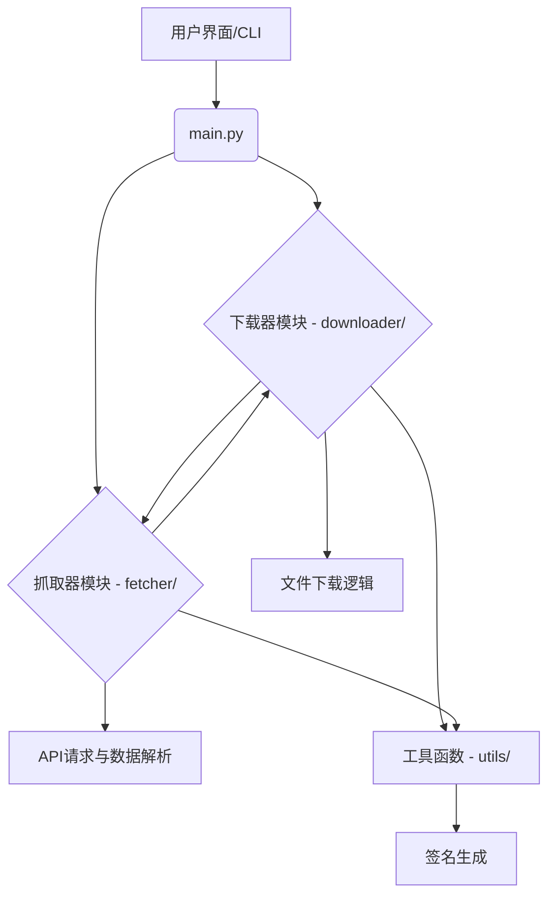

# 喜马拉雅音频批量下载工具文档

## 1. 项目简介

本项目为喜马拉雅音频平台的批量下载与管理工具，基于 Python 实现，支持专辑音频的批量获取、解密与下载，适合个人备份、学习与研究用途。

## 2. 主要功能

- **专辑批量下载**：支持通过专辑 ID 批量获取并下载全部音频，支持断点续传。
- **多线程下载**：可配置线程数，大幅提升下载速度。
- **音频 URL 解密**：自动解密加密的音频播放链接。
- **收听历史获取**：可获取个人账号的收听历史（需配置 Cookie）。
- **单曲信息抓取与下载**：支持通过 trackId 获取单个音频的详细信息，并可单独下载音频，支持根据音频标题自动命名文件。
- **专辑简介 Markdown 支持**：下载专辑时自动生成 Markdown 格式的专辑简介（album_info.md），便于阅读和管理。
- **API 签名生成**：内置 xm-sign 生成逻辑，适配新版接口。
- **图形界面支持**：集成简单 GUI，便于操作。

## 3. 项目架构

本项目采用模块化设计，主要分为以下几个核心组件：


**说明**：
- **用户界面/CLI**：提供图形界面 (`gui/gui.py`) 和命令行接口，作为用户与工具交互的入口。
- **`main.py`**：项目主入口，负责初始化应用和协调各模块。
- **下载器模块 (`downloader/`)**：
    - 负责音频文件的实际下载，包括单曲和专辑的批量下载。
    - 处理下载重试、断点续传等逻辑。
- **抓取器模块 (`fetcher/`)**：
    - 负责从喜马拉雅平台抓取专辑信息、音轨列表、加密URL等数据。
    - 包含对API响应的解析和数据结构化。
- **工具函数 (`utils/`)**：
    - 提供辅助功能，如音频URL解密、文件路径处理等。
    - **签名生成 (`ximalaya_xmsign.py`)**：负责生成喜马拉雅API请求所需的 `xm-sign` 签名。

## 4. 目录结构

```
ximalaya-main/
├── downloader/           # 下载核心模块
│   ├── album_download.py
│   └── downloader.py
│   └── single_track_download.py
├── fetcher/              # 数据抓取与解析
│   ├── album_fetcher.py
│   ├── history_fetch.py
│   ├── track_fetcher.py
│   └── track_info_fetcher.py
├── gui/                  # 图形界面
│   └── gui.py
├── tests/                # 单元测试
│   ├── test_downloader.py
│   └── test_fetcher.py
├── utils/                # 工具函数与签名生成
│   ├── utils.py
│   └── ximalaya_xmsign.py
├── .env                  # 环境变量配置文件 (不提交到版本控制)
├── .gitignore            # Git 忽略文件
├── main.py               # 启动入口（含 GUI）
├── pyproject.toml        # 项目依赖管理 (uv)
├── README.md             # 项目说明
├── uv.lock               # uv 锁定文件
└── xm-demo.py            # xm-sign 生成示例
```

## 5. 环境准备与部署

### 5.1 环境要求

- Python 3.11 及以上版本
- `uv` 包管理器 (推荐)

### 5.2 依赖安装

本项目使用 `uv` 进行依赖管理。请确保您的环境中已安装 `uv`。如果未安装，可以通过 `pip` 安装：
```shell
pip install uv
```
然后，在项目根目录运行以下命令安装所有依赖：
```shell
uv sync
```

### 5.3 Cookie 配置（如需获取收听历史或下载 VIP 内容）

为了获取收听历史或下载部分受限内容，您需要配置喜马拉雅的 `Cookie`。
1. 登录喜马拉雅网页版。
2. 打开浏览器开发者工具（F12），切换到 `Network` (网络) 标签页。
3. 刷新页面，找到任意一个对 `ximalaya.com` 域名的请求（例如：`https://www.ximalaya.com/revision/track/history/listen`）。
4. 在请求的 `Headers` (请求头) 中找到并复制 `Cookie` 字段的完整内容。
5. 在项目根目录新建 `.env` 文件（如果已存在则编辑），内容如下：
   ```dotenv
   XIMALAYA_COOKIES="<你的Cookie内容>"
   ```
   **注意**：`.env` 文件已被添加到 `.gitignore`，不会被提交到版本控制，请放心配置敏感信息。

### 5.4 运行指南

#### 5.4.1 图形界面启动 (推荐)

推荐使用 GUI 进行操作，支持专辑批量下载、路径选择等功能，操作直观：
```shell
python main.py
```

#### 5.4.2 命令行使用

**批量下载专辑**：
```shell
python -m downloader.album_download --album_id <专辑ID> [--start_page 1] [--end_page N] [--threads 4]
```
- 支持断点续传和多线程下载。
- 下载完成后会在专辑目录下自动生成 `album_info.md`，包含专辑简介（Markdown 格式）。

**抓取单曲信息**：
```shell
python -m fetcher.track_info_fetcher --track_id <音频ID> [--album_id <专辑ID>]
```
- 可获取音频详细信息。

**下载单曲 (支持智能命名)**：
```shell
python -m downloader.single_track_download --track_id <音频ID> [--album_id <专辑ID>] [--output <保存文件名>]
```
- 支持根据音频标题自动命名文件。

**获取收听历史**：
```shell
python -m fetcher.history_fetch
```
- 需先配置 `XIMALAYA_COOKIES` 环境变量。

**API 签名测试**：
```shell
python -m utils.ximalaya_xmsign
# 或
python xm-demo.py
```

## 6. 贡献指南

我们欢迎并感谢所有对本项目感兴趣的贡献者！如果您希望参与项目开发，请遵循以下步骤：

1.  **Fork 项目**：在 GitHub 上 Fork 本项目到您的个人仓库。
2.  **克隆到本地**：
    ```shell
    git clone https://github.com/your-username/ximalaya-main.git
    cd ximalaya-main
    ```
3.  **创建分支**：为您的新功能或 Bug 修复创建一个新的分支：
    ```shell
    git checkout -b feature/your-feature-name
    # 或
    git checkout -b bugfix/your-bug-fix
    ```
4.  **安装依赖**：确保所有依赖都已安装：
    ```shell
    uv sync
    ```
5.  **编写代码**：
    - 遵循项目现有的代码风格和规范。
    - 确保您的代码有清晰的注释。
    - **编写单元测试**：为您的新功能或修改编写相应的单元测试，确保代码的健壮性。
6.  **运行测试**：在提交前，请确保所有测试通过：
    ```shell
    pytest
    ```
7.  **提交更改**：
    ```shell
    git add .
    git commit -m "feat: Add your feature description"
    # 或
    git commit -m "fix: Fix your bug description"
    ```
    请使用清晰、简洁的提交信息。
8.  **推送分支**：
    ```shell
    git push origin feature/your-feature-name
    ```
9.  **提交 Pull Request (PR)**：
    - 在 GitHub 上向本项目提交 Pull Request。
    - 在 PR 描述中详细说明您的更改内容、目的以及如何测试。

感谢您的贡献！

## 7. 注意事项

- **Cookie 有效期有限，失效请重新获取。**
- **部分 VIP 内容需账号权限。**
- **专辑下载会自动生成 album_info.md（Markdown 简介），便于归档。**
- **请勿用于商业或非法用途，仅供学习交流。**
- **如遇接口变动或反爬升级，请关注项目更新。**

## 8. 常见问题

- 下载速度慢？请尝试增加线程数。
- 下载失败？请检查 Cookie、专辑 ID 是否正确，或接口是否变动。
- 其他问题请提交 issue 或自行调试。